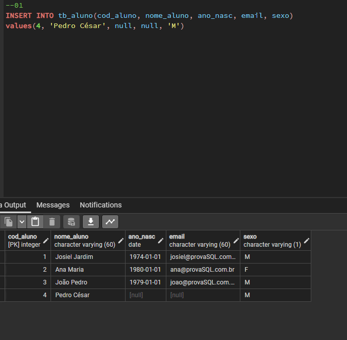
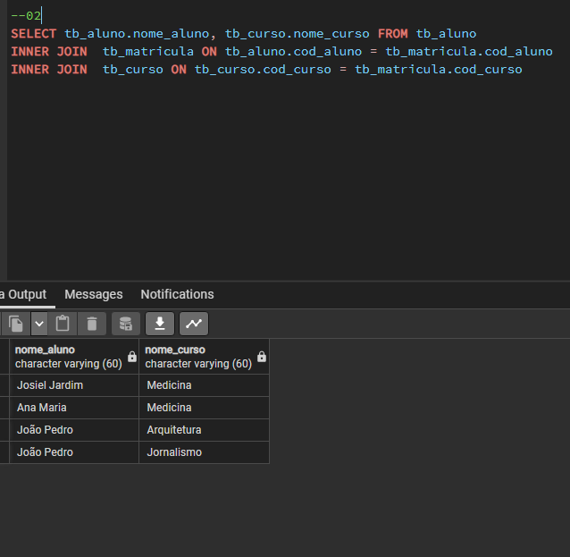
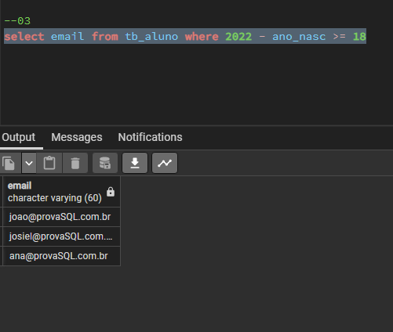
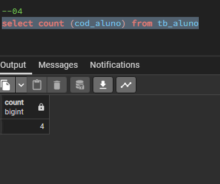
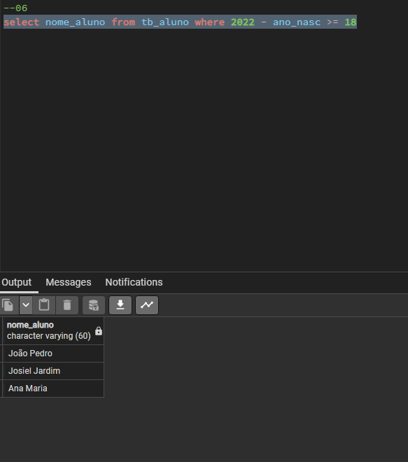
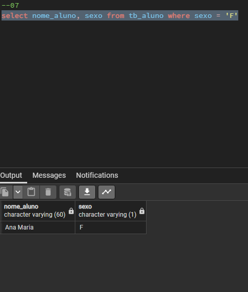
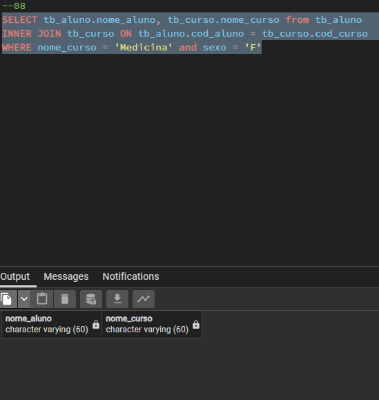
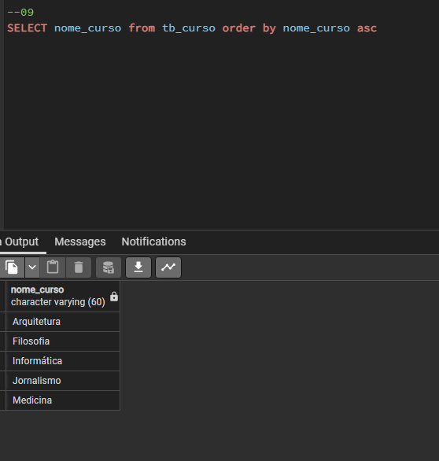
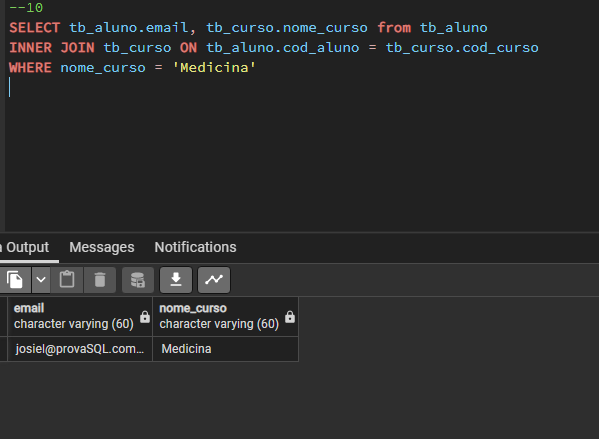

# Avaliação pratica de banco de dados SQL

>## Criação das tabelas

```bash 
# Tabela aluno
```

```bash 
# Code Tabela aluno
create table tb_aluno (
	cod_aluno int primary key,
	nome_aluno varchar(60) not null,
	ano_nasc int,
	email varchar(60),
	sexo varchar(1) not null
    )
```

```bash 
# Tabela curso
```
```bash 
# Code tabela curso
create table tb_curso(
	cod_curso int primary key,
	nome_curso varchar(60) not null
)
```

```bash 
# Tabela matricula
```
```bash 
# Code tabela matricula
create table tb_matricula(
	cod_curso int references tb_curso(cod_curso),
	cod_aluno int references tb_aluno(cod_aluno)
)
```

>## Inserindo os dados
```bash 
# Insert aluno
```
```bash 
# Code insert dos dados da tabela aluno
insert into tb_aluno(cod_aluno,nome_aluno,ano_nasc,email,sexo)
values(1, 'Josiel Jardim', '1974','josiel@provaSQL.com.br','M');
values(2, 'Ana Maria', '1980','ana@provaSQL.com.br','F');
values(3, 'João Pedro', '1979','joao@provaSQL.com.br','M');
```

```bash 
# Insert curso
```
```bash 
# Code insert dos dados da tabela curso
insert into tb_curso(cod_curso, nome_curso)
values(1, 'Medicina')
values(2, 'Arquitetura')
values(3, 'Filosofia')
values(4, 'Informática')
values(5, 'Jornalismo')
```

```bash 
# Insert matricula
```
```bash 
# Code insert dos dados da tabela matricula
insert into tb_matricula(cod_curso, cod_aluno)
values(1, 1)
values(1, 2)
values(2, 3)
values(5, 3)
```
## Resposta das questões práticas:

### 1) Faça um comando SQL para matricular o aluno “Pedro César” no curso de Informática. Os dados devem ser inseridos na tabela TB_MATRÍCULA.

<div align="center">
  
</div>

```bash 
# Code 
insert into tb_aluno(cod_aluno, nome_aluno, ano_nasc, email, sexo)
values (4, 'Pedro César', null, null ,'M')
insert into tb_matricula(cod_curso, cod_aluno)
values(4,4)
```
- - -
### 2) Escreva um comando SQL que retorne os nomes dos alunos e do(s) cursos em que estão matriculados. Os dados deverão estar ordenados pelo nome do curso.

<div align="center">
  
</div>

```bash 
# Code
select tb_aluno.nome_aluno, tb_curso.nome_curso FROM tb_aluno
INNER JOIN tb_curso ON tb_aluno.cod_aluno = tb_matricula.cod_aluno
INNER JOIN  tb_curso ON tb_curso.cod_curso = tb_matricula.cod_curso
```
- - -
### 3) Crie um comando SQL que retorne o e-mail de todos os alunos maiores de idade.

<div align="center">
  
</div>

```bash 
select email from tb_aluno where 2022 - ano_nasc >= 18
```
- - -
### 4) Desenvolva um comando SQL que mostre o total de alunos.

<div align="center">
  
</div>

```bash
select count (cod_aluno) from tb_aluno
```
- - -
### 5) Escreva um comando SQL para listar o total de alunos matriculador em cada curso.

<div align="center">
  
</div>

```bash

```
- - -
### 6) Desenvolva um comando SQL que retorne o nome de todos os alunos maiores que 18 anos.

<div align="center">
  
</div>

```bash
select nome_aluno from tb_aluno where 2022 - ano_nasc >= 18
```
- - -
### 7) Faça um comando SQL que retorne o nome de todas as mulheres.

<div align="center">
  
</div>

```bash
select nome_aluno, sexo from tb_aluno where sexo = 'F'
```
- - -
### 8) Faça um comando SQL que retorne o nome de todas as mulheres matriculadas no curso de Medicina.

<div align="center">
  
</div>

```bash
SELECT tb_aluno.nome_aluno, tb_curso.nome_curso from tb_aluno
INNER JOIN tb_curso ON tb_aluno.cod_aluno = tb_curso.cod_curso
WHERE nome_curso = 'Medicina' and sexo = 'F'
```
- - -
### 9) Faça um comando SQL que retorne os nomes dos cursos ordenados por ordem alfabética.

<div align="center">
  
</div>

```bash
SELECT nome_curso from tb_curso order by nome_curso asc
```
- - -
### 10) Crie o enunciado de uma consulta SQL que utilize “junção” (com resposta).
### Enunciado
<br>

#### Mostre o email de todos os alunos que estão no curso de medicina
<br>

<div align="center">
  
</div>

```bash
SELECT tb_aluno.email, tb_curso.nome_curso from tb_aluno 
INNER JOIN tb_curso ON tb_aluno.cod_aluno = tb_curso.cod_curso
WHERE nome_curso = 'Medicina'
```
- - -

## Respostas da questões teóricas
### 1) Defina: SQL.
##### R: Standard Query Language(Linguagem de Consulta Estruturada).A linguagem de pesquisa de banco de dados relacionais.
- - -
### 2) Faça um relacionamento cronológico sobre SQL.
##### R: A linguagem SQL foi desenvolvida pela IBM no final dos anos 70 como a linguagem usada em seu protótipo de banco de dados relacional chamado System R. O primeiro banco de dados comercial utilizando a linguagem SQL foi lançado pela Oracle em 1979. No início dos anos 1980, o American National Standards Institute (ANSI) começou a trabalhar no desenvolvimento de uma versão padronizada do SQL, que foi publicada em 1986 e 1987. Posteriormente, o SQL sofreu importantes melhorias com outras modificações e adições. Como é padronizado pela ANSI para linguagens como C, C++ e Pascal, alguns fabricantes de bancos de dados consideram seguro adotá-lo como linguagem padrão para seus bancos de dados. Outro fator que pode ser mais importante que o anterior e levar à adoção do padrão SQL por diversos bancos de dados é que a linguagem não é procedural. Bancos de dados como Access, SQL Server, Oracle, DB2 e Paradox usam SQL. Embora esses bancos de dados usem a maior parte do padrão ANSI SQL, os programadores encontrarão algumas alterações e adições ao padrão desses bancos de dados. Uma das grandes vantagens do SQL é que ele é a língua franca dos bancos de dados profissionais. Grande parte dessa linguagem é padronizada. Obviamente, dependendo do banco de dados utilizado (MSSQL Server, Oracle, DB2, etc.). 
- - -
### 3) Liste as principais caracteríticas de SQL.
##### R: Algumas das principais características do SQL são: sintaxe de comandos o mais próximo possível da linguagem da língua inglesa; Trabalha com conjuntos de registros, e não com um registro por vez; Utilizada por utilizadores "normais" tanto também pelos Administradores do Banco de Dados. Seus comandos permitem: Fazer consultas aos dados; Criar, ler, atualizar e deletar os dados em um banco de dados; Garantir a consistência de dados

- - -
### 4) Descreva a sintaxe do comando SQL: SELECT. Quais cláusulas são obrigatórias e quais são opcionais?
##### R:  
##### SELECT lista de campos a serem selecionados FROM origem dos campos, nome da tabela

##### SELECT: Cláusula obrigatória em uma consulta SQL, responsável por listar todas as colunas que serão projetadas na consulta.

##### FROM: Nesta Cláusula informamos a fonte das informações, podendo ser apenas uma ou várias. Também é obrigatória e juntamente com a cláusula SELECT formam a base de qualquer consulta SQL
- - -
### 5) Qual a importância da linguagem SQL no desenvolvimento de softwares atualmente? Justifique.
##### R: A importância do SQL no software reside principalmente no armazenamento de dados. Com o SQL é possível criar um banco de dados para armazenar informações, por exemplo, sobre uma empresa. 
##### Ao usar o SQL como banco de dados, todas as atividades podem ser executadas com mais eficiência. O usuário, portanto, encontra todas as informações necessárias durante a pesquisa. Investir em bancos de dados pode beneficiar as empresas. Ou seja, afeta não só a produtividade da equipe, mas também o alinhamento entre as equipes e os resultados alcançados.  
##### Quem quer trabalhar com desenvolvimento de software deve aprender SQL porque a maioria dos sistemas de informação interage com bancos de dados e é a linguagem universal para fazer tudo em bancos de dados relacionais.
